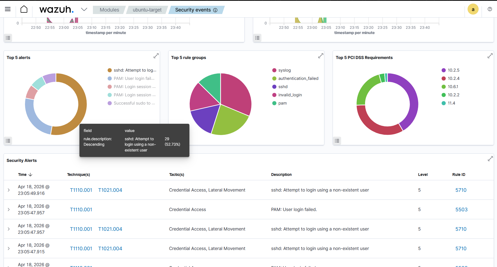
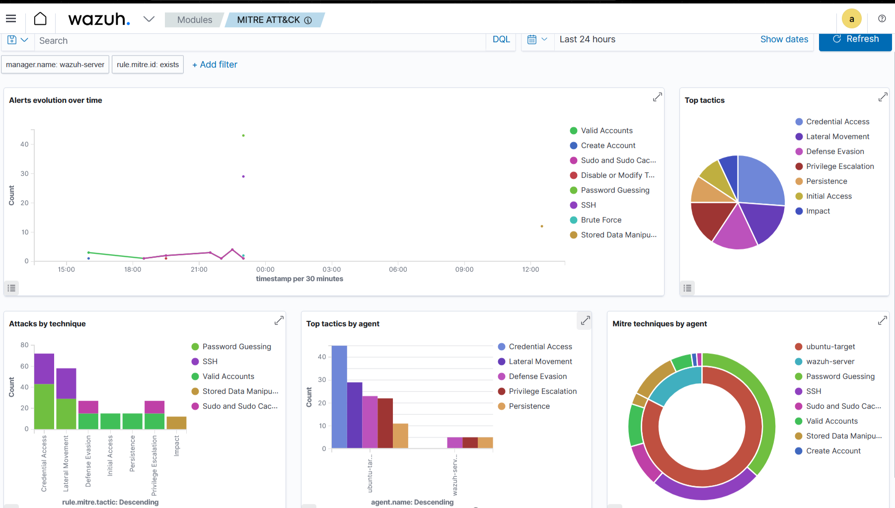

# Wazuh SIEM Lab – Detecting Nmap Reconnaissance & SSH Brute Force

## Objective

Simulate network reconnaissance and brute force attacks against a protected endpoint, detect the malicious activity using the Wazuh SIEM platform, and analyze the generated alerts to identify attacker behavior, MITRE ATT&CK mappings, and indicators of compromise.

---

## Lab Environment

| VM | Role | OS | IP Address | Specs |
|---|---|---|---|---|
| Wazuh-Server | SIEM Manager | Ubuntu Server 24.04.4 LTS | `192.168.23.131` | 4 vCPU, 4 GB RAM, 40 GB disk |
| Ubuntu-Target | Victim / Wazuh Agent | Ubuntu Server 24.04.4 LTS | `192.168.23.132` | 2 vCPU, 2 GB RAM, 20 GB disk |
| Kali-Attacker | Attacker | Kali Linux 2026.1 | `192.168.23.130` | 4 vCPU, 4 GB RAM, 80 GB disk |

**Network:** NAT (VMware Workstation)  
**Wazuh Version:** 4.7.x  
**Agent Version:** 4.7.x (downgraded from 4.14.x to match manager)

---

## Architecture Diagram
```
[Kali Attacker] --(Nmap / SSH brute force)--> [Ubuntu-Target]
|
| Wazuh Agent
v
[Wazuh-Server]
(SIEM)
```
---

## Phase 1 – Infrastructure Setup

1. Deployed 3 virtual machines using **VMware Workstation**.
2. Installed **Ubuntu Server 24.04.4 LTS** on Wazuh-Server and Ubuntu-Target.
3. Installed **Wazuh All-in-One** (Manager + Indexer + Dashboard) on Wazuh-Server.
4. Deployed and registered **Wazuh Agent** on Ubuntu-Target.
5. Verified network connectivity via `ping` between all nodes.

---

## Phase 2 – Attack Simulation

### Reconnaissance Script (`scan.sh`)

Created a Bash automation script to standardize the attack:

```bash
#!/bin/bash

# ============================================================
# Title: Basic Reconnaissance Scanner
# Author: Chido Chivungwa
# Purpose: Educational - SIEM Detection Lab
# Target: Ubuntu-Target VM
# ============================================================

# Check if user provided a target IP
if [ $# -eq 0 ]; then
    echo "[!] Error: No target specified"
    echo "[*] Usage: $0 <target-ip>"
    echo "[*] Example: $0 192.168.1.20"
    exit 1
fi

# Store the first argument in a variable
TARGET=$1

# Print banner
echo "=================================="
echo "  RECONNAISSANCE SCAN STARTED"
echo "=================================="
echo "[*] Target: $TARGET"
echo "[*] Start Time: $(date)"
echo "[*] Tool: Nmap (Stealth Scan)"
echo ""

# Run the actual scan
echo "[*] Scanning open ports..."
sudo nmap -sS -Pn $TARGET

# Print completion message
echo ""
echo "[*] Scan completed: $(date)"
echo "[*] Check Wazuh dashboard for detection alerts"

```
### Execution:
```
chmod +x scan.sh
./scan.sh 192.168.23.132
```

### Brute Force Attack
Executed a controlled SSH brute force to trigger high-fidelity detection:

for i in {1..15}; do 
    sshpass -p "wrongpassword$i" ssh -o ConnectTimeout=3 -o StrictHostKeyChecking=no labuser@192.168.23.132 "echo test"
done

### Why this attack vector?
While the Nmap SYN scan generated firewall blocks visible in /var/log/syslog, Wazuh's default rule set prioritizes authentication-based anomalies. The SSH brute force triggered immediate, high-confidence alerts with full MITRE ATT&CK mapping.

---

## Phase 3 – Detection & Analysis

## Wazuh Alert Summary

| Timestamp (UTC)    | Alert Description                                  | Rule ID | Level | MITRE Technique      |
| ------------------ | -------------------------------------------------- | ------- | ----- | -------------------- |
| `23:05:49` | `sshd: Attempt to login using a non-existent user` | 5710    | 5     | T1110.001, T1021.004 |
| `23:05:47` | `PAM: User login failed.`                          | 5503    | 5     | T1110.001            |

---
### Key Indicators

Attacker IP (Source): 192.168.23.130
Target IP (Destination): 192.168.23.132
Target Port: 22/TCP (SSH)
Attack Type: Brute Force / Password Guessing
MITRE Tactics: Credential Access, Lateral Movement

---

### Dashboard Evidence

**Authentication failures detected in real-time:**



**MITRE ATT&CK mapping automatically applied:**



*Additional screenshots from each phase of the lab are available in the `screenshots/` folder.*

---

## Challenges & Troubleshooting

| Issue                         | Root Cause                                                       | Resolution                                                             |
| ----------------------------- | ---------------------------------------------------------------- | ---------------------------------------------------------------------- |
| Agent version mismatch        | Ubuntu repos installed Wazuh Agent 4.14.x, but Manager was 4.7.x | Downgraded agent to 4.7.5-1 to match manager version                   |
| Agent registration failed     | Config file reset to `MANAGER_IP` placeholder after reinstall    | Manually edited `/var/ossec/etc/ossec.conf` with correct manager IP    |
| Nmap scan not visible in SIEM | Ubuntu default firewall does not log rejected SYN packets        | Enabled `ufw` and turned on verbose logging to generate syslog entries |
| SSH brute force timed out     | `ufw` blocked port 22 after enabling                             | Added explicit rule: `sudo ufw allow 22/tcp`                           |


---
## Tools & Technologies
* SIEM: Wazuh 4.7
* Scanner: Nmap 7.98
* Automation: Bash / Shell Scripting
* Virtualization: VMware Workstation
* OS: Ubuntu Server 24.04.4 LTS, Kali Linux 2026.1
* Framework: MITRE ATT&CK

---
## Lessons Learned

* Version alignment is critical in distributed security tools. Agent-manager version mismatches prevent registration entirely.

* Default OS configurations hide evidence. Ubuntu does not log dropped SYN packets by default; enabling UFW was necessary to generate SIEM-visible logs.

* Authentication events are high-signal. Wazuh's default rules heavily weight SSH/PAM anomalies, making brute force an ideal demonstration vector.

* SIEM detection is not magic. It requires proper log sources, network connectivity, and rule tuning. Understanding *why* an alert fires is as important as seeing the alert.

---
## How to Reproduce

1. Deploy 3 VMs in VMware NAT network.
2. Install Wazuh All-in-One on Ubuntu Server.
3. Install matching Wazuh Agent on second Ubuntu Server.
4. Run scan.sh from Kali against the target.
5. Execute SSH brute force loop from Kali.
6. Observe alerts in Wazuh Dashboard under Security Events.

---
## Author
Chido Chivungwa


Aspiring Cybersecurity Analyst


[LinkedIn Profile URL](https://www.linkedin.com/in/chido-chivungwa-abb243348/)


[GitHub Profile URL](https://github.com/Chido-Chivungwa)
